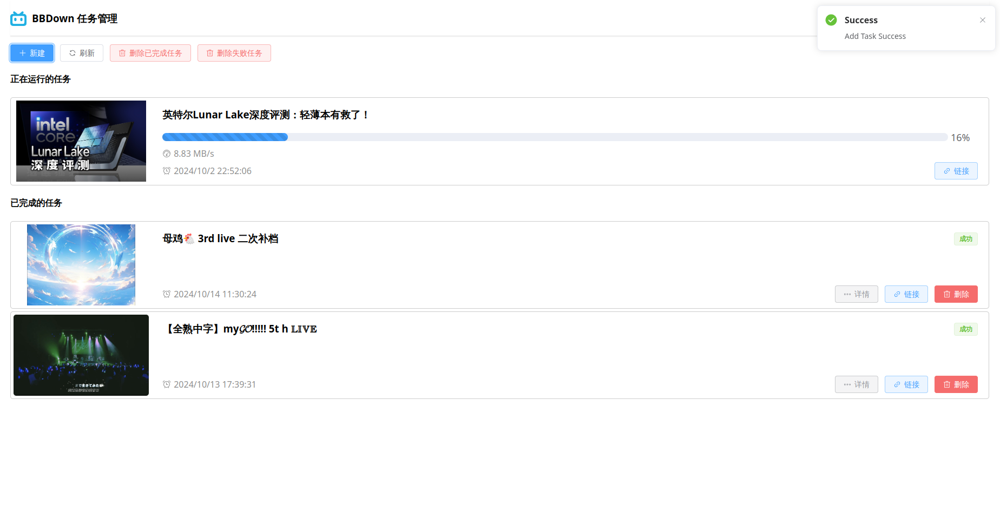

# BBDown WebUI

This project provides a WebUI for managing download tasks via the [BBDown](https://github.com/nilaoda/BBDown) backend service. It utilizes a frontend built with Vue 3, Vite, and Element Plus, and communicates with the backend using a REST API.

## Prerequisites

- **BBDown Backend**: Ensure you have the BBDown backend binary ready, which can be started using the `serve` command.
- **Nginx(Any web server you like)**: For serving the frontend and proxying backend API requests.
- **systemd(Optional)**: To set up BBDown backend auto-start on system boot.

## Build Guide

To build the frontend, run the following command:

```bash
npm install
npm run build
```

This will generate the `dist` directory containing the compiled frontend files.

## Deployment Guide

### 1. Start the BBDown Backend

Run the following command to start the backend:

```bash
BBDown serve -l http://127.0.0.1:12345
```

This starts the BBDown backend service, listening on port `12345`.

### 2. Deploy the WebUI Frontend

Download the `dist` files from the [release page](https://github.com/WindLX/BBDownWebUI/releases/) and place them in Nginx’s web root directory:

```bash
/var/www/bbdown
```

### 3 Configure the Backend API Endpoint

Run the following command to start the backend:

```bash
BBDown login
BBDown serve -l http://127.0.0.1:12345
```

This starts the BBDown backend service, listening on port `12345`.

#### 3.1 (Optional) Set up `systemd` for BBDown Auto-Start

Create a systemd service file to start BBDown on boot:

```bash
sudo vim /etc/systemd/system/bbdown.service
```

Paste the following configuration:

```ini
[Unit]
Description=BBDown Backend Service
After=network.target

[Service]
ExecStart=/root/bbdown/BBDown serve -l http://127.0.0.1:12345
WorkingDirectory=/root/bbdown
Restart=always
User=root

[Install]
WantedBy=multi-user.target
```

Save the file, then enable and start the service:

```bash
sudo systemctl enable bbdown.service
sudo systemctl start bbdown.service
```

### 4. Configure Nginx

Update your Nginx configuration to serve the frontend and proxy API requests to the backend.

Edit `/etc/nginx/sites-available/default`:

```nginx
server {
    listen 89 default_server;
    listen [::]:89 default_server;

    root /var/www/bbdown;
    index index.html;

    server_name _;

    location / {
        try_files $uri /index.html;
    }

    location /api/ {
        rewrite ^/api/(.*)$ /$1 break;
        proxy_pass http://127.0.0.1:12345;

        proxy_set_header Host $host;
        proxy_set_header X-Real-IP $remote_addr;
        proxy_set_header X-Forwarded-For $proxy_add_x_forwarded_for;
        proxy_set_header X-Forwarded-Proto $scheme;
    }

    location /favicon.ico {
        try_files $uri /index.html;
    }
}
```

Reload Nginx to apply the changes:

```bash
sudo systemctl reload nginx
```

### 5. Access the WebUI

Once deployed, you can access the WebUI by navigating to `http://<your-server-ip>:89` in your browser.

## Preview




## TODO

- [ ] Dockerize the project

## Thanks

This project is based on the work of [BBDown](https://github.com/nilaoda/BBDown)